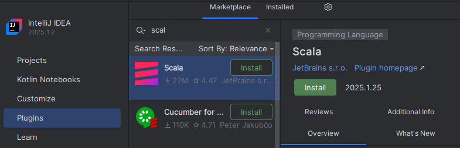

# Шаг 4. IntelliJ IDEA. Установка, настройка и тестовые проекты
## Установка IntelliJ IDEA
Установить  **IntelliJ IDEA** можно через центр приложений Ubuntu. На данный момент устанавливается IntelliJ IDEA Community Edition версии 2025.2 - это свободная версия, доступная под лицензией Apache 2.0.
https://www.apache.org/licenses/LICENSE-2.0

По завершении установки запустить **IntelliJ IDEA**, перейти в пункт меню **plugins** ->  выбарть plugin **scala** ->  нажать кнопку **Install**.  
  

По окончании установки, можно перейти к созданию проекта Scala. (кнопка/меню **New Project**). Далее, в окне настройки проекта, выбрать в меню "New Project" (*меню слева*) - **Scala**  

 

## Тестовый проект "ColorHelloScala" - сборка sbt package
Это простой scala проект со сборкой через **sbt package**. Результатом данного проекта будет являться **"тонкий"** jar файл, который запускается на исполнение через среду **scala**. Запуск командой **java -jar myfile.jar** такой сборки является затруднительным, т.к. использются билиотеки классов из **scala**. Для сборки **fat jar**  - требуется использовать **sbt assembly**. (пример такой сборки приведен далее, в **Тестовый проект "ColorHelloSBTAssembly"**)  
[Шаги создания и сборки проекта через **sbt package** тестового проекта "ColorHelloScala"  ](stp_04_p2_package_project.md)

## Тестовый проект "ColorHelloSBTAssembly" - сборка sbt assembly
Это scala проект со сборкой через **sbt assembly**. Результатом данного проекта будет являться **"fat jar"** файл, который запускается на исполнение через среду **java (JVM)**. (с помощью команды java -jar)

[Шаги создания и сборки проекта через **sbt assembly** тестового проекта "ColorHelloSBTAssembly"  ](stp_04_p3_assembly_project.md)
  
