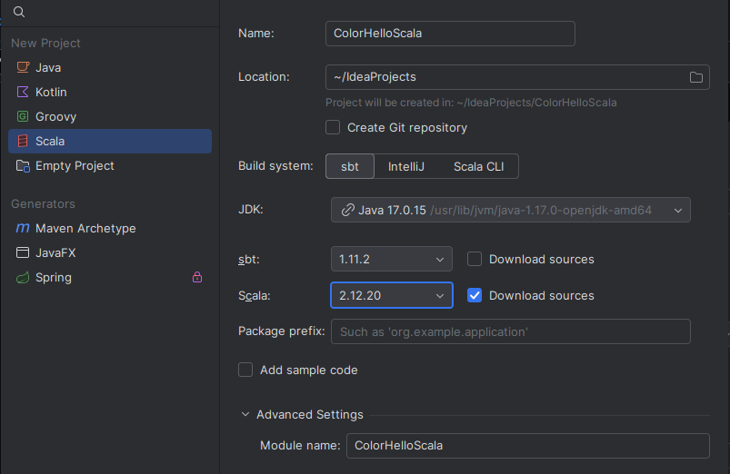
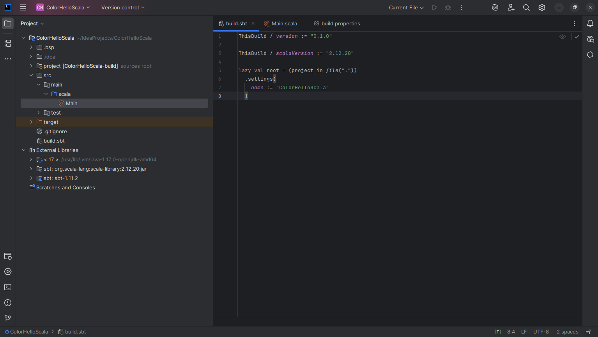
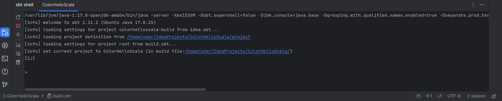
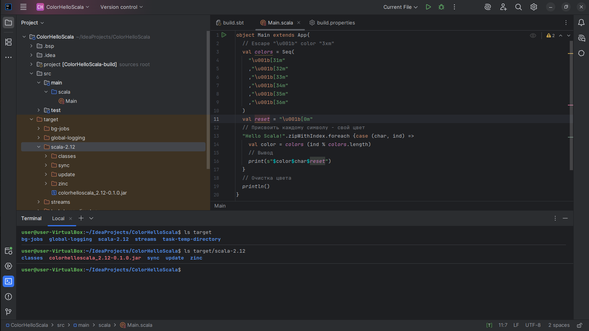
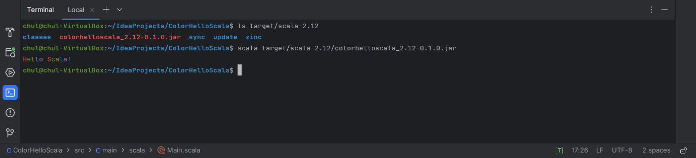

# IntelliJ IDEA. sbt package. Тестовый проект "ColorHelloScala"

**Настройки проекта:**  

|Настройка|Значение|
|:-|:-|
|Name|ColorHelloScala|
|Build System|sbt|
|JDK|17|
|sbt|1.11.7|
|Scala|2.13.16|
|Download sources|Выбрано|
|Add sample code|*по желанию*

**Пример экрана с настройками:**  
   

Нажать кнопку **Create** и будет создан проект **ColorHelloScala**. В созданном проекте **ColorHelloScala** заполнить три **файла**:  
- project/build.propeties  
- buld.sbt  
- src/main/scala/Main.scala  

**Файл build.propeties**
```scala
sbt.version = 1.11.7
```

**Файл build.sbt** (*после каждой настройки не забыть оставить пустую строку*)
```scala
ThisBuild / version := "0.1.0"

ThisBuild / scalaVersion := "2.13.16"

lazy val root = (project in file("."))
  .settings(
    name := "ColorHelloScala"
  )
```  

**Файл Main.scala**
```scala
object Main extends App{
  // Escape "\u001b" color "3xm"
  val colors = Seq(
    "\u001b[31m"
    ,"\u001b[32m"
    ,"\u001b[33m"
    ,"\u001b[34m"
    ,"\u001b[35m"
    ,"\u001b[36m"
  )
  val reset = "\u001b[0m"
  // Присвоить каждому символу - свой цвет
  "Hello Scala!".zipWithIndex.foreach {case (char, ind) =>
    val color = colors (ind % colors.length)
    // Вывод
    print(s"$color$char$reset")
  }
  // Очистка цвета
  println()
}
```

**Пример экрана проекта:**  
   

**Сборка проекта**  
Выбираем **sbt shell** (левое нижнее меню или нажимаем **Ctrl+Shift+S**)  
   

Будет загружен сервер sbt, после чего необходимо ввести команду **"package"** или **"run"** 
Команда **package**  произведет сборку проекта и в папке target/scala-2.13 появится исполняемый файл **colorhelloscala_2.13-0.1.0.jar**. Проверить это можно через вызов в терминале
```console
ls target/scala-2.13
```
   

Команда **run** произведет сборку проекта и запустит colorhelloscala_2.13-0.1.0.jar на исполнение.  
**Результат выполнения:**
   

Исполняемый файл можно посмотреть также в инструменте **"Terminal**  
```console
ls target/scala-2.13
```
и запустить на исполнение
```console
scala target/scala-2.13/colorhelloscala_2.13-0.1.0.jar
```
**Пример экрана**  
   
