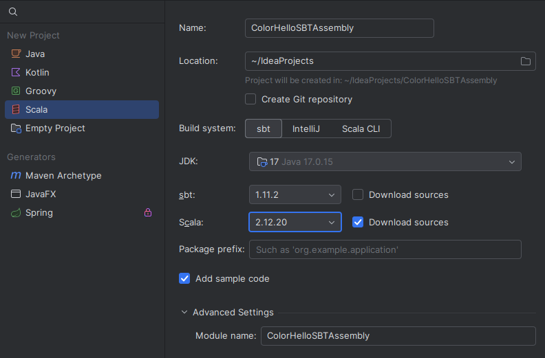
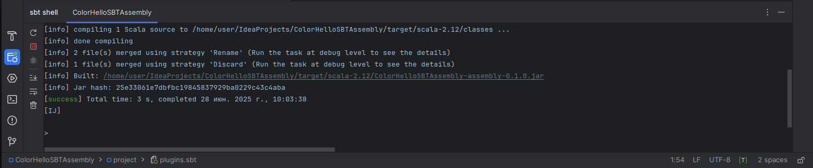
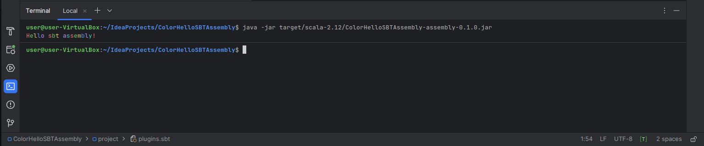

# IntelliJ IDEA. sbt assembly. Тестовый проект "ColorHelloSBTAssembly"

**Настройки проекта:**  

|Настройка|Значение|
|:-|:-|
|Name|ColorHelloSBTAssembly|
|Build System|sbt|
|JDK|17|
|sbt|1.11.2|
|Scala|2.12.20|
|Download sources|Выбрано|
|Add sample code|*по желанию*|  

**Пример экрана с настройками:**  
   

Нажать кнопку **Create** и будет создан проект **ColorHelloSBTAssembly**.В созданном проекте **ColorHelloSBTAssembly** заполнить четыре **файла**:  
- project/build.propeties  
- buld.sbt
- project/plugins.sbt (файл необходимо создать сасмостятельно)
- src/main/scala/ColorHelloSBTAssembly.scala (файл необходимо создать сасмостятельно)  
(* *если при создании проекта, был создан файл src/main/scala/Main.scala - его необходимо удалить*)   

**Файл plugins.sbt**
```scala
addSbtPlugin("com.eed3si9n" % "sbt-assembly" % "2.1.5")
```
**Файл build.propeties**
```scala
sbt.version = 1.11.2
```
**Файл build.sbt:**
```scala
ThisBuild / version := "0.1.0"

ThisBuild / scalaVersion := "2.12.20"

lazy val root = (project in file("."))
  .settings(
    name := "ColorHelloSBTAssembly"
  )

assembly / mainClass := Some("com.color.hello.sbt.ColorHelloSBTAssembly")
```
**Файл ColorHelloSBTAssembly.scala:**
```scala
package com.color.hello.sbt
object ColorHelloSBTAssembly extends App{
  // Escape "\u001b" color "3xm"
  val colors = Seq(
    "\u001b[31m"
    ,"\u001b[32m"
    ,"\u001b[33m"
    ,"\u001b[34m"
    ,"\u001b[35m"
    ,"\u001b[36m"
  )
  val reset = "\u001b[0m"
  // Присвоить каждому символу - свой цвет
  "Hello sbt assembly!".zipWithIndex.foreach {case (char, ind) =>
    val color = colors (ind % colors.length)
    // Вывод
    print(s"$color$char$reset")
  }
  // Очистка цвета
  println()
}
```

Перейти в инструмент **sbt-shell**  
Ввести команду **assembly** (*если будет собщение, что assembly - неизвестная команда, выполнить команды clean и reload, или просто остановить и запуситить инструмент заново*)  
После ввода команды **assembly** будет произведена компиляция и сборка "fat jar":

   

Далее можно выполнить собранный **.jar** из терминала:
```console
java -jar target/scala-2.12/ColorHelloSBTAssembly-assembly-0.1.0.jar
```
**Результат:**
   
