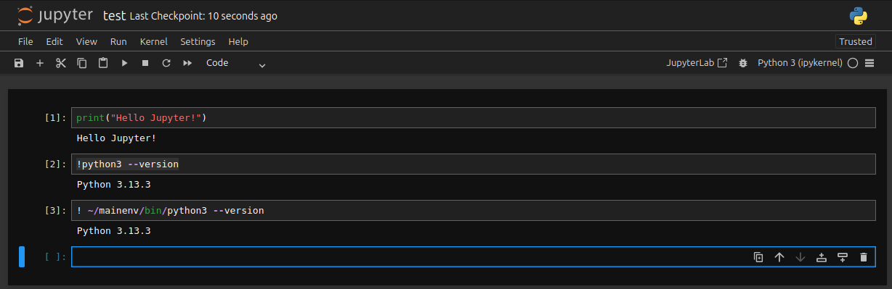

# Шаг 6. Установка и настройка Jupter Notebook
## Установка jupyter Notebook
### Подготовка к установке
```console
sudo apt update
sudo apt upgrade
```
Необходимо установить пакеты:
- python3 - стандартный интерпретатор Python
- python3-dev - файлы разработки Python, заголовочные файлы и библиотеки для компиляции и сборки Python-пакетов из исходного кода
- python3-venv - модуль для создания виртуальных окружений Python
- python3-pip - менеджер пакетов для Python
 
```console
sudo apt install python3 python3-dev python3-venv python3-pip
```
## Создание виртуального окружения Python для установки Jupyter Notebook
Создание рабочих директорий (не обязательно, предназначено для удобства)
```console
mkdir -p ~/WORKSHOP # для проектов разработки
mkdir -p ~/WORKSHOP/DEVPYTHON # для общих проектов Python (будущее ядро "DevPython 3.1x")
mkdir -p ~/WORKSHOP/MLPYTHON # для проектов ML Python (будущее ядро "ML Python 3.1x") 
mkdir -p ~/WORKSHOP/PYTORCH # для проектов PyTorch (будущее ядро "PyTorch")
mkdir -p ~/WORKSHOP/PYSPARK # для проектов PySpark (будущее ядро "PySpark")
```
Основное виртуальное окружение Python (без окружения, начиная с версии Ubuntu 23.10, установить Juprter Notebook будет затруднительно)
```console
python3 -m venv mainenv # Окружение mainenv
source mainenv/bin/activate # Активация окружения
pip install --upgrade pip # Обновление пакета pip
pip install jupyter # Установка пакета Jupyter
deactivate
```
## Создание файла запуска Jupyter Notebook на рабочем столе (по желанию):
```console
nano "$(xdg-user-dir DESKTOP)/Jupyter_launch.sh"
```
В файл необходимо записать:
```bash
#!/bin/bash

full_path="WORKSHOP"

cd ~/$full_path

source ../mainenv/bin/activate

jupyter notebook --ip=0.0.0.0
```
Cделать файл исполняемым через меню по "правой кнопки мыши" или командой:
```console
sudo chmod +x "$(xdg-user-dir DESKTOP)/Jupyter_launch.sh"
```
Файл будет на рабочем столе и теперь можно запустить Jupyter Notebook (правая кнопка мыши -> Запустить как программу)

Проверить работоспособность. 
   

## Создание целевых окружений для использования
Будут созданы 4 окружения:
- Окружение python dev
- Окружение ml dev
- Окружение pytorch
- Окружение Spark

### Окружение Python Dev
Окружение общего назначения для работы в Python - с установкой модулей
```console
python3 -m venv pydevenv
source pydevenv/bin/activate
python3 -m pip install ipykernel
python -m ipykernel install --user --name=pydevenv --display-name "DevPython 3.1x"
pip install pandas
pip install fastparquet
deactivate
```
 - Notebook с подсказками по параметрам ядра (положить в ~/WORKSHOP/DEVPYTHON/)  

### Окружение Python ML
```console
python3 -m venv pymlenv
source pymlenv/bin/activate
python3 -m pip install ipykernel
python -m ipykernel install --user --name=pymlenv --display-name "MLPython 3.1x"
pip install pandas
deactivate 
```
 - Notebook с подсказками по параметрам ядра (положить в ~/WORKSHOP/MLPYTHON/)  

### Окружение PyTorch
```console
python3 -m venv pytorchenv
source pytorchenv/bin/activate
python3 -m pip install ipykernel
python -m ipykernel install --user --name=pytorchenv --display-name "PyTorch"
deactivate
```
 Notebook с установкой torch (положить в ~/WORKSHOP/MLPYTHON/)  

### Окружение PySpark
```console
python3 -m venv pysparkenv
source pysparkenv/bin/activate
python3 -m pip install ipykernel
python -m ipykernel install --user --name=pysparkenv --display-name "PySpark"
pip install pyspark==3.5.6 # Установить PySpark 3.5.6
deactivate
```
Установить переменные виртуального окружения
```console
echo 'export SPARK_HOME=/opt/spark' >> pysparkenv/bin/activate
echo 'export PYSPARK_PYTHON=$(which python)' >> pysparkenv/bin/activate
```
По указанным путям отредактировать файл kernel.json
```console
nano ~/.local/share/jupyter/kernels/pysparkenv/kernel.json
```
```json
{
 "argv": [
  "~/pysparkenv/bin/python",
  "-Xfrozen_modules=off",
  "-m",
  "ipykernel_launcher",
  "-f",
  "{connection_file}"
 ],
 "env":{
        "SPARK_HOME":"/opt/spark",
        "PYSPARK_PYTHON":"$HOME/pysparkenv/bin/python"
},
 "display_name": "PySpark",
 "language": "python",
 "metadata": {
  "debugger": true
 }
}
```
 Notebook с подсказками по параметрам ядра (положить в ~/WORKSHOP/PYSPARK/)  
 Notebook с пирмером запуска spark сессии  (положить в ~/WORKSHOP/PYSPARK/)  


Пример запуска spark сессии:
```python
import os
import sys
spark_home = os.environ.get('SPARK_HOME', None)
sys.path.insert(0, spark_home + "python")
os.environ["SPARK_LOCAL_IP"]='localhost'
from pyspark import SparkContext, SparkConf#, HiveContext
conf = SparkConf()\
             .setAppName("Example Spark")\
             .setMaster("local[2]")\
             .setAppName("CountingSheep")\
             .set("spark.sql.catalogImplementation", "hive")
sc = SparkContext(conf=conf)
sc.setLogLevel("ERROR")
```
```python
exec(open(os.path.join(spark_home, 'python/pyspark/shell.py')).read())
```
Результат запуска:
```shell
Welcome to
      ____              __
     / __/__  ___ _____/ /__
    _\ \/ _ \/ _ `/ __/  '_/
   /__ / .__/\_,_/_/ /_/\_\   version 3.5.6
      /_/

Using Python version 3.13.3 (main, Jun 16 2025 18:15:32)
Spark context Web UI available at http://localhost:4042
Spark context available as 'sc' (master = local[2], app id = local-1751142303797).
SparkSession available as 'spark'.
```
